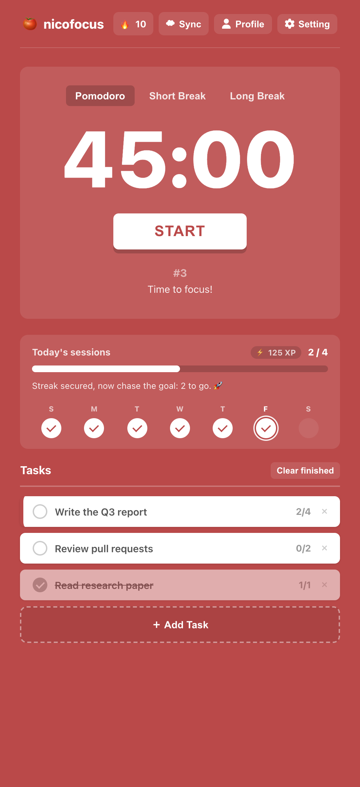
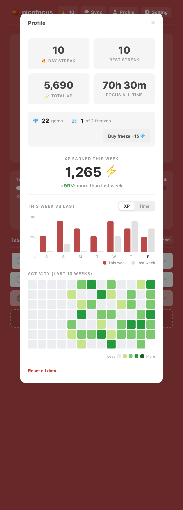
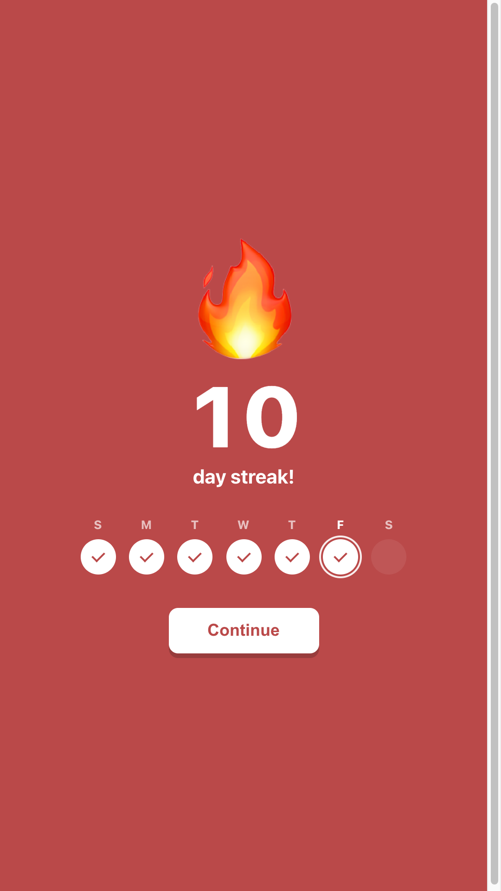
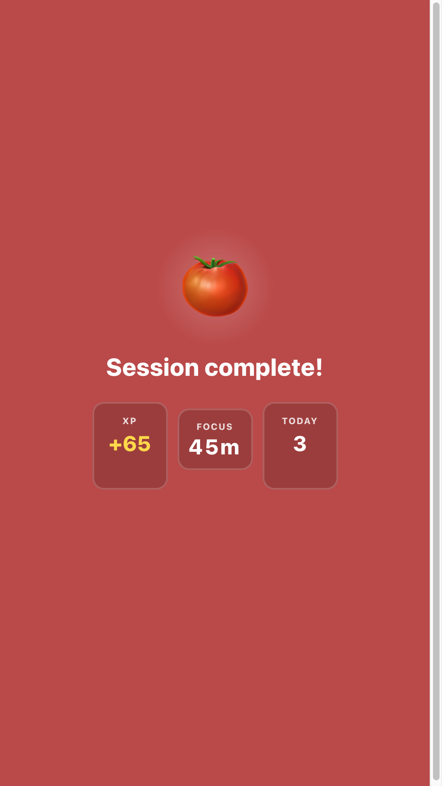

# nicofocus

A personal Pomodoro timer with a Duolingo-style daily streak. No build step, no backend.
Runs on GitHub Pages. Data is stored locally and (optionally) synced to a private folder
in your own Google Drive.

Live: https://nicopanozo.github.io/nicofocus/

## Screenshots

Responsive: the same layout adapts to desktop and mobile. Shown here at a phone width.

<p align="center">
  
  
  
  
</p>

## Project structure

Three static files, no tooling - edit and push:

- `index.html` - markup only (links the stylesheet and script)
- `styles.css` - all styles
- `app.js` - all logic, written to read top to bottom as a story: storage -> dates ->
  streak -> timer -> sound -> celebrations -> render -> profile -> settings -> events ->
  sync -> boot. The header comment documents the localStorage keys and the saved data shape.

## Features

- 45 / 5 / 15 timer (fully configurable) with long-break interval and auto-start toggles
- Daily session count that resets each day; full history kept forever
- Streak: hit your daily goal to keep it alive, miss a full day and it resets
- Report with current/best streak, total focus time, and a 13-week activity heatmap
- Simple task list with per-task session counts
- Synthesized alarm (no audio files) + optional desktop notifications
- Keyboard shortcuts: `Space` start/pause, `1/2/3` switch modes, `S` settings, `R` report
- Crash-proof: timestamp-based timer survives tab throttling/sleep; storage is guarded

## Storage

The app is **offline-first**: everything is saved to the browser's `localStorage` and
works with no account. That data is per-browser.

To use it across devices, connect Google Drive (Settings → Sync). It mirrors a single
`nicofocus.json` into a hidden, per-app folder in **your own** Drive using the narrow
`drive.appdata` scope - the app cannot see any of your other Drive files. There is no
server and no third-party database; you own the data.

History/minutes are merged with a per-day **max** so a device with stale data can never
wipe out a day's progress.

## One-time setup: Google OAuth Client ID

Sync needs a Google OAuth Client ID. It is **not a secret** and is safe to commit.

1. Go to https://console.cloud.google.com/ and create (or pick) a project.
2. **APIs & Services → Library →** enable **Google Drive API**.
3. **APIs & Services → OAuth consent screen:** choose **External**, fill the app name
   and your email. Under **Audience**, add your own Google account as a **Test user**
   (a test app works indefinitely for its test users - no Google verification needed for
   personal use).
4. **APIs & Services → Credentials → Create credentials → OAuth client ID:**
   - Application type: **Web application**
   - **Authorized JavaScript origins**, add:
     - `https://nicopanozo.github.io`
     - `http://localhost:8000` (only if you test locally - see below)
   - Create, then copy the **Client ID** (`...apps.googleusercontent.com`).
5. Paste it into the app at **Settings → Sync → Google OAuth Client ID**, then click
   **Connect**. (Or hardcode it into `GOOGLE_CLIENT_ID` near the top of the `<script>` in
   `index.html` so every device gets it automatically.)

### Local testing note

Google sign-in does **not** work from `file://` URLs (origin is null). Open the app from
a local server instead:

```bash
python3 -m http.server 8000   # then visit http://localhost:8000
```

Local-only mode (no sync) works fine from `file://`.

## Deploy

It's already a static `index.html`, so GitHub Pages serves it as-is. In the repo:
**Settings → Pages → Build and deployment → Source: Deploy from a branch → `main` /
`(root)`**.
